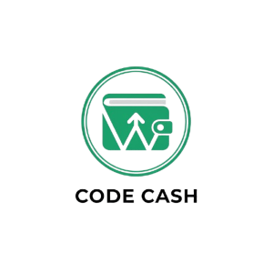
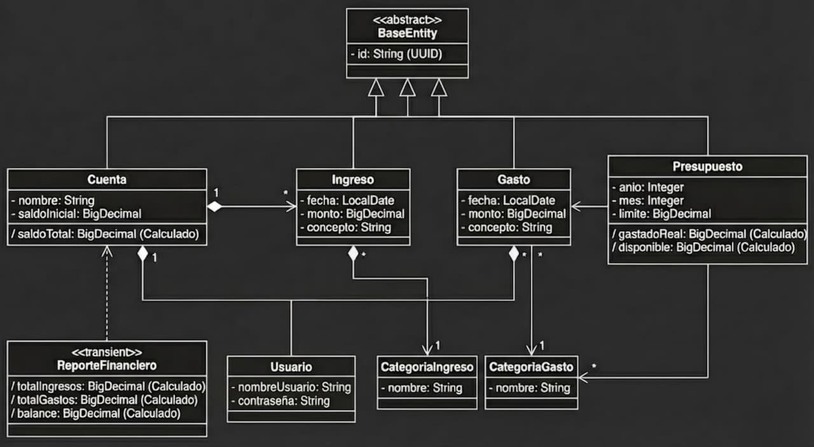

# CodeCash :dollar::dollar::dollar:
> Tu dinero, bajo control. Sin estrés.

**CodeCash** es la herramienta sencilla que necesitas para entender a dónde se va tu dinero cada mes. Olvídate de guardar tickets arrugados o pelearte con fórmulas complicadas en Excel. Nosotros hacemos las matemáticas por ti para que tú solo te preocupes de cumplir tus metas.

## Beneficios :credit_card:
- Gratis y de código abierto
- Accesible desde el navegador
- Interfaz amigable e intuitiva
- Controla eficientemente tu dinero

## Cómo usarlo :question:
Puedes registrar una **cuenta**, esta cuenta tendrá su propio **saldo** y tendrá el ingreso de gastos e **ingresos**.

Gastos e Ingresos tienen sus propias categorías. Los gastos pueden tener un presupuesto por categoría.

## Diagrama de clases

python>>>>>java
